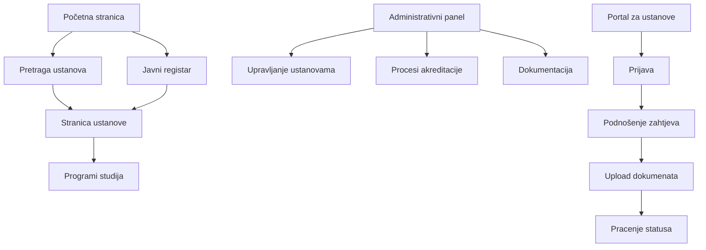

## 1. Pregled proizvoda

Državni registar akreditiranih visokoškolskih ustanova u Bosni i Hercegovini je centralizovana digitalna platforma za evidenciju, praćenje i javno objavljivanje informacija o akreditiranim visokoškolskim ustanovama. Sistem omogućava ministarstvu obrazovanja efikasno upravljanje procesom akreditacije, evidenciju ustanova i javni pristup informacijama.

Ciljna grupa: Službenici ministarstva obrazovanja, visokoškolska ustanova, studenti i javnost.

### 2.1 Korisničke uloge

| Uloga                     | Način registracije                    | Osnovne dozvole                     |
| ------------------------- | ------------------------------------- | ----------------------------------- |
| Administrator sistema     | Direktna registracija                 | Puni pristup svim funkcijama        |
| Službenik za akreditaciju | Registracija od strane administratora | Upravljanje procesom akreditacije   |
| Visokoškolska ustanova    | Registracija sa potvrdom              | Podnošenje zahtjeva za akreditaciju |
| Javnost                   | Bez registracije                      | Pregled javnih informacija          |

### 2.2 Moduli funkcionalnosti

Glavne stranice aplikacije:

1. **Početna stranica**: Pretraga ustanova, javni registar, najave
2. **Stranica ustanove**: Detalji o ustanovi, programi, akreditacije
3. **Administrativni panel**: Upravljanje ustanovama, procesi akreditacije
4. **Portal za ustanove**: Podnošenje zahtjeva, dokumentacija
5. **Javni registar**: Pregled akreditiranih ustanova i programa

### 2.3 Detalji stranica

| Naziv stranice        | Naziv modula         | Opis funkcionalnosti                        |
| --------------------- | -------------------- | ------------------------------------------- |
| Početna stranica      | Pretraga ustanova    | Pretraga po nazivu, lokaciji, vrsti studija |
| Početna stranica      | Mapa ustanova        | Interaktivna mapa svih ustanova             |
| Početna stranica      | Najave               | Obavještenja o isteku akreditacija          |
| Stranica ustanove     | Osnovni podaci       | Naziv, adresa, kontakt, web stranica        |
| Stranica ustanove     | Programi studija     | Lista svih programa sa stepenima            |
| Stranica ustanove     | Status akreditacije  | Trenutni status i datum isteka              |
| Administrativni panel | Lista ustanova       | Pregled svih registriranih ustanova         |
| Administrativni panel | Procesi akreditacije | Aktivni i završeni procesi                  |
| Administrativni panel | Dokumentacija        | Pregled podnesene dokumentacije             |
| Portal za ustanove    | Prijava              | Sistem za autentifikaciju ustanova          |
| Portal za ustanove    | Podnošenje zahtjeva  | Formular za novu akreditaciju               |
| Portal za ustanove    | Dokumenti            | Upload potrebne dokumentacije               |
| Javni registar        | Lista akreditiranih  | Pregled svih akreditiranih ustanova         |
| Javni registar        | Programi             | Lista akreditiranih programa                |
| Javni registar        | Izvještaji           | Statistički pregledi i izvještaji           |

## 3. Osnovni procesi

### Proces akreditacije:

1. Ustanova podnosi zahtjev preko portala
2. Službenik pregleda dokumentaciju
3. Prolazi proces evaluacije
4. Donosi se odluka o akreditaciji
5. Objavljuje se u javnom registru

### Proces obnove akreditacije:

1. Sistem šalje obavještenje o isteku
2. Ustanova podnosi zahtjev za obnovu
3. Prolazi proces re-evaluacije
4. Obnavlja se akreditacija

## 4. Korisnički interfejs

### 4.1 Stil dizajna

* Primarne boje: Plava (#1e40af) i bijela (#ffffff)

* Sekundarne boje: Siva (#6b7280) i svijetlo plava (#3b82f6)

* Stil dugmića: Zaobljeni uglovi sa sjenkama

* Font: System font stack (Inter, sans-serif)

* Veličine fonta: 16px za osnovni tekst, 14px za manje elemente

* Ikonice: Minimalističke SVG ikonice

### 4.2 Pregled dizajna stranica

| Naziv stranice        | Modul          | UI elementi                                  |
| --------------------- | -------------- | -------------------------------------------- |
| Početna stranica      | Pretraga       | Velika pretraga box, filteri po kategorijama |
| Početna stranica      | Mapa           | Interaktivna mapa sa markerima ustanova      |
| Stranica ustanove     | Osnovni podaci | Kartica sa osnovnim informacijama, logo      |
| Stranica ustanove     | Programi       | Tabela programa sa stepenima i trajanju      |
| Administrativni panel | Lista          | Tabela sa sortiranjem i filterima            |
| Administrativni panel | Procesi        | Timeline prikaz procesa akreditacije         |
| Portal za ustanove    | Formular       | Više-stepeni formular sa validacijom         |
| Javni registar        | Pretraga       | Advanced search sa više filtera              |

### 4.3 Responsivnost

* Desktop-first pristup sa break pointovima za tablet i mobilni

* Touch optimizacija za mobilne uređaje

* Pregledne tabele na svim veličinama ekrana

