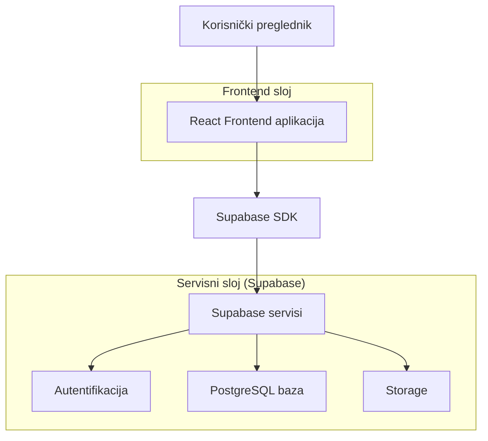
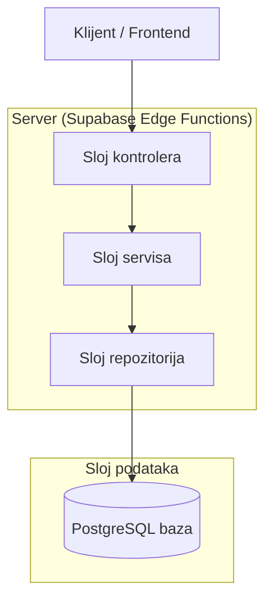
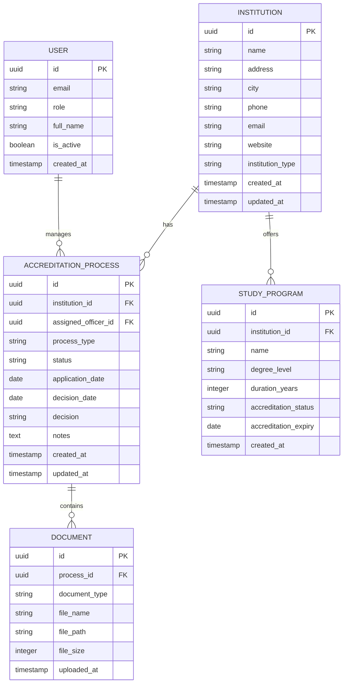

## 1. Dizajn arhitekture



## 2. Opis tehnologija

- Frontend: React@18 + TailwindCSS@3 + Vite
- Alat za inicijalizaciju: vite-init
- Backend: Supabase (BaaS platforma)
- Baza podataka: PostgreSQL (unutar Supabase)
- Storage: Supabase Storage za dokumente

## 3. Definicije ruta

| Ruta | Svrha |
|-------|---------|
| / | Početna stranica sa pretragom |
| /ustanova/:id | Detalji o ustanovi |
| /registar | Javni registar ustanova |
| /admin | Administrativni panel |
| /admin/ustanove | Upravljanje ustanovama |
| /admin/akreditacije | Procesi akreditacije |
| /portal | Portal za ustanove |
| /portal/zahtjev | Podnošenje zahtjeva |
| /login | Prijava za administratore |
| /profil | Profil ustanove |

## 4. API definicije

### 4.1 Korisnička autentifikacija

```
POST /auth/v1/token
```

Request:
| Parametar | Tip | Obavezno | Opis |
|-----------|-------------|-------------|-------------|
| email | string | da | Email adresa korisnika |
| password | string | da | Lozinka |

Response:
| Parametar | Tip | Opis |
|-----------|-------------|-------------|
| access_token | string | JWT token za autentifikaciju |
| refresh_token | string | Token za osvježavanje sesije |
| user | object | Korisnički podaci |

### 4.2 Upravljanje ustanovama

```
GET /rest/v1/institutions
```

Query parametri:
| Parametar | Tip | Opis |
|-----------|-------------|-------------|
| search | string | Pretraga po nazivu |
| city | string | Filtriranje po gradu |
| accreditation_status | string | Filtriranje po statusu |
| limit | number | Ograničenje rezultata |
| offset | number | Pomak za paginaciju |

```
POST /rest/v1/institutions
```

Request body:
| Parametar | Tip | Obavezno | Opis |
|-----------|-------------|-------------|-------------|
| name | string | da | Naziv ustanove |
| address | string | da | Adresa |
| city | string | da | Grad |
| phone | string | ne | Telefon |
| email | string | da | Email |
| website | string | ne | Web stranica |
| institution_type | string | da | Tip ustanove |

### 4.3 Procesi akreditacije

```
GET /rest/v1/accreditation_processes
```

```
POST /rest/v1/accreditation_processes
```

Request body:
| Parametar | Tip | Obavezno | Opis |
|-----------|-------------|-------------|-------------|
| institution_id | uuid | da | ID ustanove |
| accreditation_type | string | da | Tip akreditacije |
| requested_date | date | da | Datum zahtjeva |
| documents | array | da | Lista dokumenata |

## 5. Dijagram serverske arhitekture



## 6. Model podataka

### 6.1 Definicija modela podataka



### 6.2 SQL definicija tabela

Tabela institucija (institutions):
```sql
CREATE TABLE institutions (
    id UUID PRIMARY KEY DEFAULT gen_random_uuid(),
    name VARCHAR(255) NOT NULL,
    address VARCHAR(500) NOT NULL,
    city VARCHAR(100) NOT NULL,
    phone VARCHAR(50),
    email VARCHAR(255) NOT NULL,
    website VARCHAR(255),
    institution_type VARCHAR(50) NOT NULL CHECK (institution_type IN ('university', 'college', 'academy')),
    accreditation_status VARCHAR(50) DEFAULT 'pending' CHECK (accreditation_status IN ('pending', 'accredited', 'expired', 'suspended')),
    created_at TIMESTAMP WITH TIME ZONE DEFAULT NOW(),
    updated_at TIMESTAMP WITH TIME ZONE DEFAULT NOW()
);

-- Indeksi za brzu pretragu
CREATE INDEX idx_institutions_name ON institutions(name);
CREATE INDEX idx_institutions_city ON institutions(city);
CREATE INDEX idx_institutions_status ON institutions(accreditation_status);
```

Tabela studijskih programa (study_programs):
```sql
CREATE TABLE study_programs (
    id UUID PRIMARY KEY DEFAULT gen_random_uuid(),
    institution_id UUID REFERENCES institutions(id) ON DELETE CASCADE,
    name VARCHAR(255) NOT NULL,
    degree_level VARCHAR(50) NOT NULL CHECK (degree_level IN ('bachelor', 'master', 'phd', 'professional')),
    duration_years INTEGER NOT NULL CHECK (duration_years > 0 AND duration_years <= 6),
    accreditation_status VARCHAR(50) DEFAULT 'pending',
    accreditation_expiry DATE,
    ects_credits INTEGER,
    created_at TIMESTAMP WITH TIME ZONE DEFAULT NOW(),
    updated_at TIMESTAMP WITH TIME ZONE DEFAULT NOW()
);

CREATE INDEX idx_study_programs_institution ON study_programs(institution_id);
CREATE INDEX idx_study_programs_status ON study_programs(accreditation_status);
```

Tabela procesa akreditacije (accreditation_processes):
```sql
CREATE TABLE accreditation_processes (
    id UUID PRIMARY KEY DEFAULT gen_random_uuid(),
    institution_id UUID REFERENCES institutions(id) ON DELETE CASCADE,
    assigned_officer_id UUID REFERENCES auth.users(id),
    process_type VARCHAR(50) NOT NULL CHECK (process_type IN ('initial', 'renewal', 're-evaluation')),
    status VARCHAR(50) NOT NULL CHECK (status IN ('submitted', 'under_review', 'approved', 'rejected', 'appeal')),
    application_date DATE NOT NULL,
    decision_date DATE,
    decision VARCHAR(50),
    notes TEXT,
    created_at TIMESTAMP WITH TIME ZONE DEFAULT NOW(),
    updated_at TIMESTAMP WITH TIME ZONE DEFAULT NOW()
);

CREATE INDEX idx_accreditation_institution ON accreditation_processes(institution_id);
CREATE INDEX idx_accreditation_status ON accreditation_processes(status);
CREATE INDEX idx_accreditation_officer ON accreditation_processes(assigned_officer_id);
```

Tabela dokumenata (documents):
```sql
CREATE TABLE documents (
    id UUID PRIMARY KEY DEFAULT gen_random_uuid(),
    process_id UUID REFERENCES accreditation_processes(id) ON DELETE CASCADE,
    document_type VARCHAR(100) NOT NULL,
    file_name VARCHAR(255) NOT NULL,
    file_path VARCHAR(500) NOT NULL,
    file_size INTEGER,
    mime_type VARCHAR(100),
    uploaded_by UUID REFERENCES auth.users(id),
    uploaded_at TIMESTAMP WITH TIME ZONE DEFAULT NOW()
);

CREATE INDEX idx_documents_process ON documents(process_id);
```

### 6.3 Supabase politike pristupa

-- Osnovne dozvole za anonimne korisnike
```sql
GRANT SELECT ON institutions TO anon;
GRANT SELECT ON study_programs TO anon;
GRANT SELECT ON accreditation_processes TO anon;
```

-- Pune dozvole za autentifikovane korisnike
```sql
GRANT ALL PRIVILEGES ON institutions TO authenticated;
GRANT ALL PRIVILEGES ON study_programs TO authenticated;
GRANT ALL PRIVILEGES ON accreditation_processes TO authenticated;
GRANT ALL PRIVILEGES ON documents TO authenticated;
```

-- Primjeri RLS politika
```sql
-- Institucije mogu biti pregledane od svih
ALTER TABLE institutions ENABLE ROW LEVEL SECURITY;
CREATE POLICY "Institutions are viewable by everyone" ON institutions
    FOR SELECT USING (true);

-- Procesi akreditacije mogu biti pregledani samo ako su dodeljeni korisniku
ALTER TABLE accreditation_processes ENABLE ROW LEVEL SECURITY;
CREATE POLICY "Users can view assigned processes" ON accreditation_processes
    FOR SELECT USING (
        assigned_officer_id = auth.uid() OR 
        EXISTS (
            SELECT 1 FROM institutions 
            WHERE institutions.id = accreditation_processes.institution_id
            AND institutions.email = auth.email()
        )
    );
```